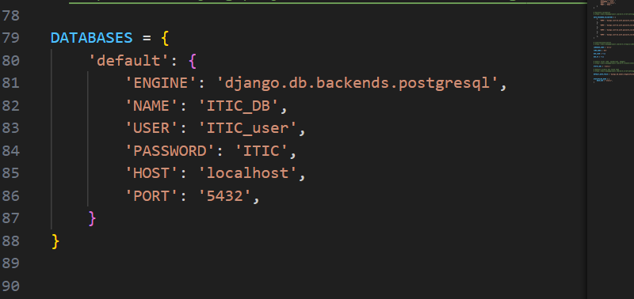
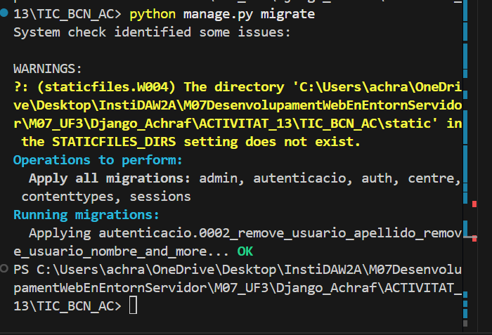
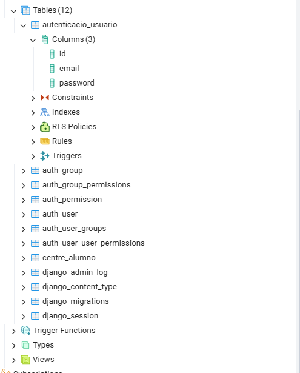

# Login Django

Creación de la aplicación:

Configuración de PostgreSQL:

Migraciones:

Tabla en PostgreSQL:

Login sin sesión:
- Email y contraseña
- Si cierras, vuelves a hacer login

Login con sesión:
- Guarda tus datos
- No hace falta hacer login cada vez

Logout:
- Botón para cerrar sesión
